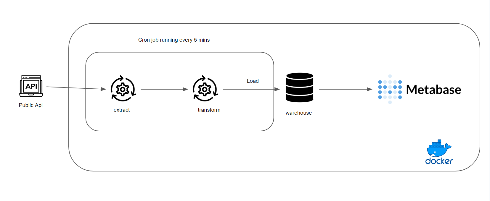
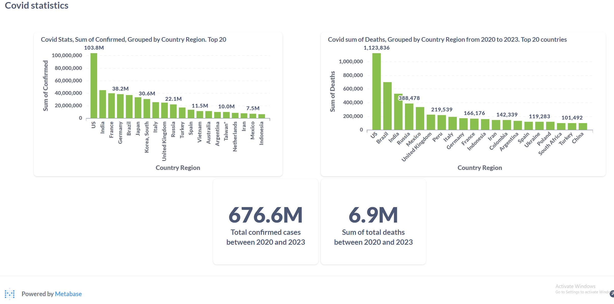

# Covid data pipeline

This is an etl pipeline to pull covid data from a public api periodically with cron, then gets stored in warehouse.

## - Tech stack:
- Python
- Terraform for GCP resources
- Pytest
- Docker
- ci/cd
- Postgres
- Metabase

## Architecture

## Dashboard

